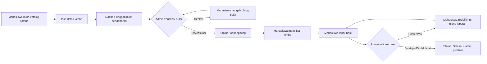
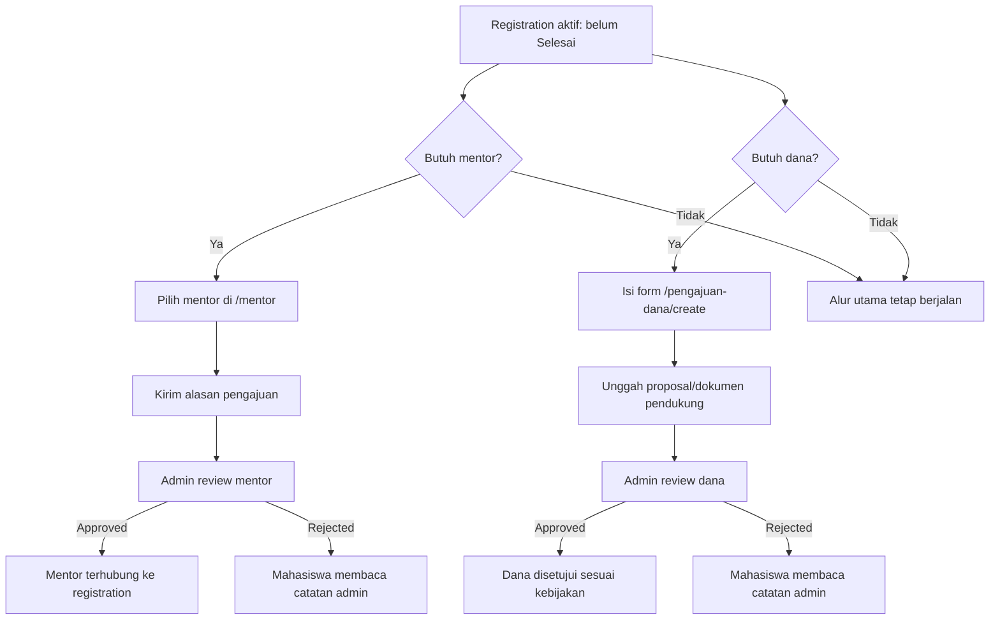
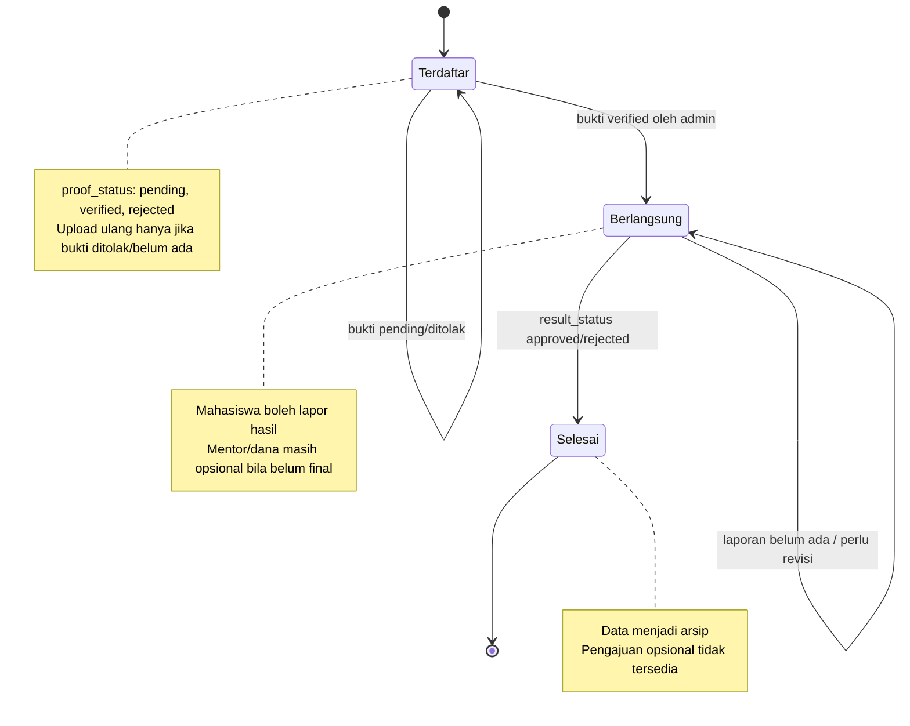
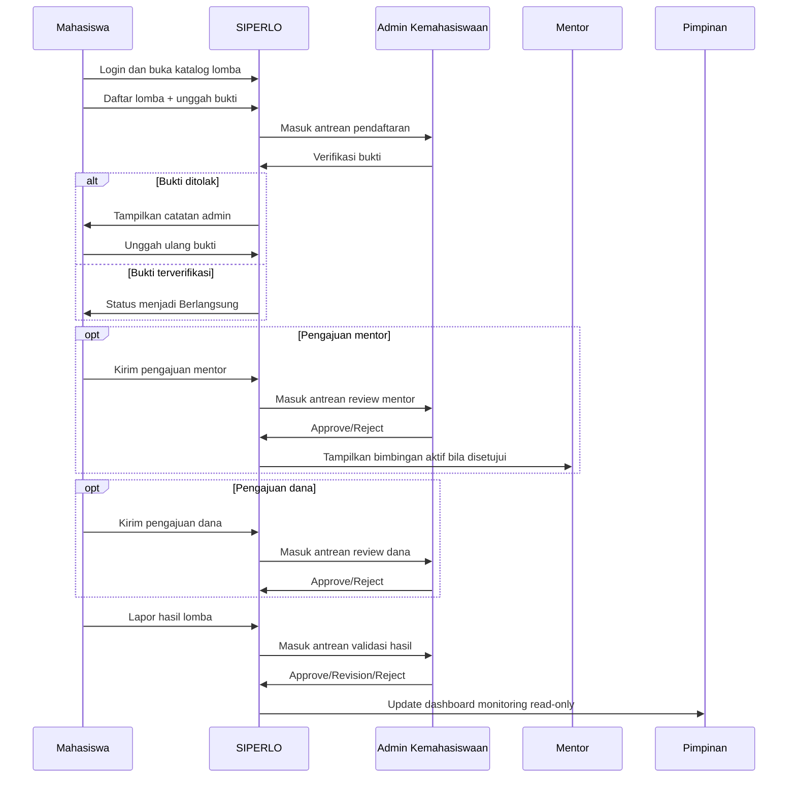
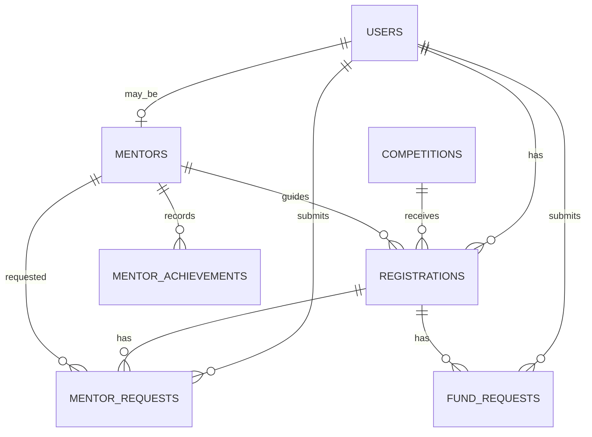

# PROSEDUR OPERASIONAL BAKU (POB)
# SIPERLO — Sistem Informasi Perlombaan Mahasiswa UPN Veteran Jakarta

> **Dokumen operasional untuk penggunaan, pengelolaan, review, monitoring, dan pemeliharaan sistem SIPERLO.**  
> Visual utama tersedia dalam format swimlane seperti POB/BPMN: [`docs/POB_SIPERLO_VISUAL.html`](docs/POB_SIPERLO_VISUAL.html).  
> Versi SVG langsung: [`docs/POB_SIPERLO_SWIMLANE.svg`](docs/POB_SIPERLO_SWIMLANE.svg).

---

## 0. Kontrol Dokumen

| Atribut | Keterangan |
|---|---|
| Nama dokumen | Prosedur Operasional Baku (POB) SIPERLO |
| Nama sistem | SIPERLO — Sistem Informasi Perlombaan Mahasiswa |
| Institusi | UPN Veteran Jakarta |
| Versi | 1.0 |
| Tanggal berlaku | 2026-06-08 |
| Pemilik proses | Bidang Kemahasiswaan UPN Veteran Jakarta |
| Pengelola aplikasi | Admin Kemahasiswaan dan Administrator IT |
| Bahasa antarmuka | Bahasa Indonesia |
| Rujukan project | Laravel 12, Blade, Tailwind CSS, MySQL, modul scraper `infolomba.id` |

---

## 1. Tujuan

POB ini disusun untuk memastikan seluruh proses perlombaan mahasiswa di SIPERLO berjalan **terstandar, terdokumentasi, dapat dilacak, dan dapat dipantau**. POB ini mengatur:

1. Pencarian dan pendaftaran lomba oleh mahasiswa.
2. Verifikasi bukti pendaftaran oleh Admin Kemahasiswaan.
3. Pengajuan mentor pendamping dan bantuan dana sebagai dukungan opsional.
4. Pelaporan hasil lomba dan validasi prestasi.
5. Monitoring oleh pimpinan melalui dashboard read-only.
6. Operasional katalog lomba, termasuk input manual dan sinkronisasi scraper.
7. Pengendalian status, dokumen, dan arsip data lomba.

---

## 2. Ruang Lingkup

POB ini berlaku untuk pengguna dan proses berikut:

| Ruang lingkup | Termasuk | Tidak termasuk |
|---|---|---|
| Operasional mahasiswa | Cari lomba, daftar lomba, unggah bukti, ajukan mentor/dana, lapor hasil | Pendaftaran eksternal di situs penyelenggara di luar SIPERLO |
| Operasional admin | Kelola katalog, verifikasi bukti, review mentor/dana, validasi hasil | Keputusan anggaran di luar data yang dicatat sistem |
| Operasional mentor | Melihat ringkasan pengajuan dan bimbingan aktif | Penilaian akademik formal di luar aplikasi |
| Monitoring pimpinan | Statistik partisipasi, prestasi, status proses | Edit data operasional |
| Operasional IT | Scraper, migration, seeding, build, backup, pemeriksaan error | Pengubahan kebijakan akademik |

---

## 3. Definisi dan Istilah

| Istilah | Definisi |
|---|---|
| SIPERLO | Sistem Informasi Perlombaan Mahasiswa UPN Veteran Jakarta. |
| Lomba/Competition | Data kompetisi yang tersedia pada katalog `/lomba`. |
| Pendaftaran/Registration | Relasi mahasiswa dengan lomba tertentu. Satu mahasiswa hanya dapat mendaftar satu kali pada lomba yang sama. |
| Bukti pendaftaran | File JPG, PNG, atau PDF maksimal 2MB yang diunggah saat mahasiswa mendaftar lomba. |
| Mentor | Dosen/pendamping yang tersedia di katalog mentor. Pengajuan mentor bersifat opsional. |
| Bantuan dana | Pengajuan dukungan pendanaan lomba. Pengajuan dana bersifat opsional. |
| Laporan hasil | Pelaporan capaian lomba oleh mahasiswa setelah status pendaftaran `Berlangsung`. |
| Status utama | Status lifecycle pendaftaran: `Terdaftar`, `Berlangsung`, `Selesai`. |
| Status review | Status keputusan admin: `pending`, `approved`, `revision`, `rejected`, atau variasi sesuai jenis review. |

---

## 4. Peran, Hak Akses, dan Tanggung Jawab

| Peran | Landing page | Hak akses utama | Tanggung jawab |
|---|---|---|---|
| Mahasiswa | `/lomba`, `/lomba-saya` | Mendaftar lomba, unggah bukti, ajukan mentor/dana, lapor hasil | Mengisi data benar, mengunggah dokumen valid, memantau catatan admin. |
| Admin Kemahasiswaan | `/admin/dashboard` | Kelola lomba, review pendaftaran/mentor/dana/hasil | Memvalidasi data, memberi keputusan dan catatan yang jelas, menjaga kualitas katalog. |
| Mentor | `/mentor-area/dashboard` | Melihat pengajuan dan daftar bimbingan | Memberi pendampingan setelah pengajuan disetujui admin. |
| Pimpinan | `/pimpinan/dashboard` | Monitoring read-only | Memantau partisipasi dan prestasi sebagai dasar evaluasi/kebijakan. |
| Administrator IT | Terminal/server | Menjalankan build, migration, scraper, backup, pemeliharaan | Menjaga ketersediaan aplikasi, integritas data, dan log operasional. |

### 4.1 Matriks RACI Ringkas

| Aktivitas | Mahasiswa | Admin | Mentor | Pimpinan | Admin IT |
|---|---:|---:|---:|---:|---:|
| Cari dan pilih lomba | R | C | - | I | - |
| Kelola katalog lomba | - | A/R | - | I | C |
| Daftar dan unggah bukti | R | C | - | I | - |
| Verifikasi bukti pendaftaran | I | A/R | - | I | - |
| Ajukan mentor | R | A/R | C | I | - |
| Ajukan bantuan dana | R | A/R | - | I | - |
| Bimbingan lomba | C | I | A/R | I | - |
| Lapor hasil | R | C | C | I | - |
| Validasi laporan hasil | I | A/R | C | I | - |
| Monitoring prestasi | I | C | I | A/R | C |
| Operasional scraper/maintenance | - | C | - | I | A/R |

Keterangan: **R** = Responsible, **A** = Accountable, **C** = Consulted, **I** = Informed.

---

## 5. Prinsip Operasional SIPERLO

1. **Alur utama harus sederhana:** pendaftaran berjalan melalui status `Terdaftar → Berlangsung → Selesai`.
2. **Dukungan mentor dan dana bersifat opsional:** tidak boleh menghambat mahasiswa mengikuti lomba.
3. **Bukti pendaftaran wajib diverifikasi:** status tidak dapat naik ke `Berlangsung` tanpa bukti yang valid.
4. **Hasil hanya dilaporkan saat lomba berlangsung:** mahasiswa dapat melapor setelah admin menandai pendaftaran sebagai `Berlangsung`.
5. **Keputusan final mengunci proses:** laporan hasil `approved` atau `rejected` membuat pendaftaran menjadi `Selesai`.
6. **Admin bekerja dari antrean:** daftar review dipisahkan berdasarkan status agar aksi berikutnya jelas.
7. **Setiap penolakan/revisi wajib disertai catatan:** catatan harus membantu mahasiswa memperbaiki dokumen atau laporan.
8. **Pimpinan bersifat read-only:** pimpinan memantau data tanpa mengubah proses operasional.

---

## 6. Visual Alur Utama

### 6.1 Diagram Ringkas Lifecycle Pendaftaran



### 6.2 Diagram Dukungan Opsional



### 6.3 Diagram Status dan Penguncian



### 6.4 Swimlane Proses Lintas Peran



---

## 7. POB Autentikasi dan Akses Sistem

### 7.1 Tujuan
Memastikan hanya pengguna terautentikasi dan berperan sesuai yang dapat mengakses fitur SIPERLO.

### 7.2 Prosedur

| No | Aktor | Langkah | Output |
|---:|---|---|---|
| 1 | Pengguna | Membuka halaman login. | Sistem menampilkan form login. |
| 2 | Pengguna | Login menggunakan email/password atau Google OAuth jika dikonfigurasi. | Pengguna masuk ke sistem. |
| 3 | Sistem | Membaca role pengguna. | Redirect ke dashboard sesuai role. |
| 4 | Sistem | Menerapkan middleware `role`. | Akses lintas peran yang tidak sah ditolak. |

### 7.3 Ketentuan

- Role default saat registrasi adalah `mahasiswa`.
- Route sensitif menggunakan middleware `auth` dan `role`.
- Aksi yang sering dikirim form menggunakan throttle, misalnya pendaftaran, unggah bukti, laporan hasil, review admin.

---

## 8. POB Pengelolaan Katalog Lomba

### 8.1 Tujuan
Menjamin katalog lomba di `/lomba` akurat, relevan, dan mudah dipilih mahasiswa.

### 8.2 Prosedur Input/Update Manual oleh Admin

| No | Aktor | Langkah | Kriteria/Output |
|---:|---|---|---|
| 1 | Admin | Masuk ke `/admin/competitions`. | Daftar lomba tampil. |
| 2 | Admin | Membuat atau mengubah data lomba. | Field utama lengkap: judul, penyelenggara, kategori, jenis, deadline, lokasi/tautan, biaya, dokumen pendukung. |
| 3 | Admin | Mengunggah poster/guidebook bila tersedia. | File tersimpan di storage publik. |
| 4 | Admin | Menetapkan status lomba: `open`, `soon`, atau `closed`. | Status menentukan ketersediaan pendaftaran. |
| 5 | Admin | Simpan perubahan. | Lomba tampil di katalog jika visible. |

### 8.3 Ketentuan Kualitas Data

- Deadline pendaftaran wajib benar karena menjadi dasar urutan dan pembatas pendaftaran.
- Lomba hanya dapat didaftari mahasiswa jika status `open` dan deadline belum lewat.
- Data hasil scraper tetap perlu ditinjau admin bila informasi belum lengkap.
- Hindari duplikasi lomba dari input manual dan hasil scraper.

---

## 9. POB Pendaftaran Lomba oleh Mahasiswa

### 9.1 Tujuan
Mencatat partisipasi mahasiswa pada lomba tertentu dengan bukti pendaftaran yang dapat diverifikasi.

### 9.2 Prasyarat

1. Mahasiswa sudah login.
2. Lomba berstatus `open`.
3. Deadline pendaftaran belum lewat.
4. Mahasiswa belum pernah mendaftar pada lomba yang sama.
5. Mahasiswa menyiapkan bukti pendaftaran dalam format JPG, PNG, atau PDF maksimal 2MB.

### 9.3 Prosedur

| No | Aktor | Langkah | Sistem/Output |
|---:|---|---|---|
| 1 | Mahasiswa | Buka `/lomba`. | Daftar lomba aktif tampil dengan filter/search. |
| 2 | Mahasiswa | Pilih lomba dan buka detail `/lomba/{competition}`. | Detail, timeline, persyaratan, dan tombol daftar tampil. |
| 3 | Mahasiswa | Klik daftar dan unggah bukti pendaftaran. | Sistem memvalidasi format dan ukuran file. |
| 4 | Sistem | Membuat record `registrations`. | `status = registered`, `proof_status = pending`. |
| 5 | Sistem | Mengarahkan ke `/lomba-saya`. | Mahasiswa melihat status menunggu verifikasi. |

### 9.4 Output

- Data pendaftaran tersimpan.
- Bukti pendaftaran masuk antrean verifikasi admin.
- Mahasiswa dapat memantau perkembangan di `/lomba-saya`.

### 9.5 Kontrol dan Validasi

| Kontrol | Implementasi |
|---|---|
| Cegah pendaftaran ganda | Constraint unik `user_id + competition_id` dan pemeriksaan existing registration. |
| Cegah pendaftaran lomba tutup | Validasi status `open` dan deadline belum lewat. |
| Cegah file tidak valid | Validasi `jpg`, `jpeg`, `png`, `pdf`, maksimal 2MB. |
| Cegah spam submit | Middleware throttle pada route pendaftaran. |

---

## 10. POB Verifikasi Bukti Pendaftaran oleh Admin

### 10.1 Tujuan
Memastikan pendaftaran mahasiswa hanya berlanjut ke status `Berlangsung` jika bukti pendaftaran valid.

### 10.2 Prosedur

| No | Aktor | Langkah | Output |
|---:|---|---|---|
| 1 | Admin | Buka `/admin/registrations`. | Antrean pendaftaran tampil. |
| 2 | Admin | Gunakan tab/filter `Terdaftar` atau pencarian. | Data yang perlu review lebih mudah ditemukan. |
| 3 | Admin | Periksa bukti pendaftaran mahasiswa. | Bukti dinilai valid/tidak valid. |
| 4 | Admin | Pilih `proof_status = verified` jika valid. | Sistem mengisi `proof_verified_at` dan otomatis menaikkan status ke `ongoing` bila masih `registered`. |
| 5 | Admin | Pilih `proof_status = rejected` jika tidak valid. | Admin wajib menulis `proof_admin_notes`. |
| 6 | Mahasiswa | Jika ditolak, unggah ulang bukti melalui `/lomba-saya/{registration}/upload-bukti`. | Status bukti kembali `pending`. |

### 10.3 Kriteria Keputusan

| Keputusan | Kriteria | Dampak |
|---|---|---|
| Verified | Bukti terbaca, relevan dengan lomba, menunjukkan mahasiswa/tim sudah mendaftar. | Status utama dapat menjadi `Berlangsung`. |
| Rejected | File buram, salah lomba, tidak menunjukkan bukti pendaftaran, format tidak sesuai, atau dokumen tidak dapat dibuka. | Mahasiswa perlu unggah ulang. |
| Pending | Belum diperiksa atau perlu konfirmasi internal. | Belum dapat lanjut ke `Berlangsung`. |

### 10.4 Batasan Sistem

- Admin tidak dapat memindahkan pendaftaran ke `Berlangsung` tanpa bukti yang sudah `verified`.
- Pendaftaran yang sudah `Berlangsung` tidak dapat dikembalikan ke `Terdaftar` secara manual.
- Status `Selesai` harus melalui validasi laporan hasil, bukan dipilih manual tanpa laporan.

---

## 11. POB Pengajuan Mentor Pendamping (Opsional)

### 11.1 Tujuan
Memberikan akses dukungan mentor bagi mahasiswa yang membutuhkan bimbingan lomba tanpa menghambat alur utama pendaftaran.

### 11.2 Prasyarat

1. Mahasiswa sudah memiliki pendaftaran lomba.
2. Pendaftaran belum berstatus `Selesai`.
3. Mahasiswa belum memiliki mentor aktif atau pengajuan mentor aktif untuk pendaftaran tersebut.
4. Mentor yang dipilih berstatus aktif.

### 11.3 Prosedur Mahasiswa

| No | Aktor | Langkah | Output |
|---:|---|---|---|
| 1 | Mahasiswa | Buka katalog mentor `/mentor`. | Profil mentor tampil. |
| 2 | Mahasiswa | Pilih mentor sesuai bidang lomba. | Detail mentor terbuka. |
| 3 | Mahasiswa | Kirim form `POST /pengajuan-mentor` berisi `registration_id`, `mentor_id`, dan alasan. | Pengajuan dibuat dengan status `pending`. |
| 4 | Mahasiswa | Pantau status pada `/lomba-saya`. | Status pengajuan terlihat. |

### 11.4 Prosedur Review Admin

| No | Aktor | Langkah | Output |
|---:|---|---|---|
| 1 | Admin | Buka `/admin/mentor-requests`. | Antrean pengajuan mentor tampil. |
| 2 | Admin | Periksa alasan, relevansi bidang, dan status pendaftaran. | Admin menentukan keputusan. |
| 3 | Admin | Pilih `approved` atau `rejected` dan isi catatan bila perlu. | Keputusan tersimpan. |
| 4 | Sistem | Jika approved, isi `registration.mentor_id`. | Mentor terhubung ke pendaftaran. |
| 5 | Sistem | Jika ada pengajuan mentor lain yang masih pending untuk pendaftaran sama, tutup otomatis. | Tidak ada duplikasi mentor aktif. |

### 11.5 Ketentuan

- Keputusan review mentor yang sudah final tidak dapat diubah dari halaman review.
- Satu pendaftaran hanya boleh memiliki satu mentor yang disetujui.
- Pengajuan mentor tidak tersedia setelah pendaftaran `Selesai`.

---

## 12. POB Pengajuan Bantuan Dana (Opsional)

### 12.1 Tujuan
Mencatat dan menstandarkan proses pengajuan bantuan dana lomba sebagai bahan review Admin Kemahasiswaan.

### 12.2 Prasyarat

1. Mahasiswa sudah memiliki pendaftaran lomba.
2. Pendaftaran belum berstatus `Selesai`.
3. Belum ada pengajuan dana aktif atau disetujui untuk pendaftaran yang sama.
4. Mahasiswa menyiapkan proposal atau dokumen pendukung bila diminta.

### 12.3 Prosedur Mahasiswa

| No | Aktor | Langkah | Output |
|---:|---|---|---|
| 1 | Mahasiswa | Buka `/pengajuan-dana/create`. | Sistem menampilkan daftar pendaftaran yang memenuhi syarat. |
| 2 | Mahasiswa | Pilih pendaftaran lomba. | Form dana aktif. |
| 3 | Mahasiswa | Isi nominal, tujuan, deskripsi, proposal, dan dokumen pendukung. | Sistem memvalidasi isian dan file. |
| 4 | Sistem | Membuat `fund_requests` status `pending`. | Pengajuan masuk antrean admin. |

### 12.4 Prosedur Review Admin

| No | Aktor | Langkah | Output |
|---:|---|---|---|
| 1 | Admin | Buka `/admin/fund-requests`. | Antrean pengajuan dana tampil. |
| 2 | Admin | Periksa nominal, tujuan, urgensi, dokumen, dan kebijakan anggaran. | Admin menentukan keputusan. |
| 3 | Admin | Pilih `approved` atau `rejected` dan isi catatan. | Keputusan tersimpan. |
| 4 | Sistem | Menolak duplikasi dana approved untuk pendaftaran yang sama. | Integritas pengajuan terjaga. |

### 12.5 Validasi File

| Field | Format | Maksimum |
|---|---|---:|
| Proposal | PDF, DOC, DOCX | 4MB |
| Dokumen pendukung | PDF, DOC, DOCX, JPG, JPEG, PNG | 4MB |

---

## 13. POB Pelaporan Hasil Lomba oleh Mahasiswa

### 13.1 Tujuan
Mencatat capaian lomba secara resmi setelah mahasiswa mengikuti kompetisi.

### 13.2 Prasyarat

1. Pendaftaran sudah berstatus `Berlangsung`.
2. Laporan hasil belum final, atau sebelumnya diberi status `revision`.
3. Mahasiswa menyiapkan data capaian dan bukti pendukung.

### 13.3 Prosedur

| No | Aktor | Langkah | Output |
|---:|---|---|---|
| 1 | Mahasiswa | Buka `/lomba-saya`. | Daftar pendaftaran tampil. |
| 2 | Mahasiswa | Pilih aksi lapor hasil pada pendaftaran `Berlangsung`. | Form `/lomba-saya/{registration}/lapor-hasil` tampil. |
| 3 | Mahasiswa | Isi hasil/capaian, deskripsi, dan unggah bukti bila ada. | Sistem memvalidasi data. |
| 4 | Sistem | Simpan laporan. | `result_status = pending`, `result_submitted_at = now`. |
| 5 | Sistem | Kirim ke antrean admin. | Admin melihat pada tab validasi hasil. |

### 13.4 Validasi File Bukti Hasil

| Field | Format | Maksimum |
|---|---|---:|
| Bukti hasil/prestasi | PDF, DOC, DOCX, JPG, JPEG, PNG | 4MB |

---

## 14. POB Validasi Laporan Hasil oleh Admin

### 14.1 Tujuan
Memastikan capaian lomba yang masuk ke monitoring dan arsip prestasi sudah ditinjau oleh Admin Kemahasiswaan.

### 14.2 Prosedur

| No | Aktor | Langkah | Output |
|---:|---|---|---|
| 1 | Admin | Buka `/admin/registrations`. | Dashboard review pendaftaran tampil. |
| 2 | Admin | Pilih tab `Validasi Hasil`. | Laporan `result_status = pending` tampil. |
| 3 | Admin | Periksa capaian, deskripsi, sertifikat/bukti, dan kecocokan lomba. | Admin menentukan status review. |
| 4 | Admin | Pilih `approved`, `revision`, atau `rejected`. | Status hasil diperbarui. |
| 5 | Sistem | Jika `approved` atau `rejected`, status utama menjadi `finished`. | Data menjadi arsip selesai. |
| 6 | Sistem | Jika `revision`, status utama kembali/bertahan `ongoing`. | Mahasiswa dapat memperbaiki laporan. |

### 14.3 Kriteria Keputusan

| Status | Kriteria | Dampak |
|---|---|---|
| `approved` | Bukti valid, capaian jelas, sesuai lomba yang diikuti. | Pendaftaran menjadi `Selesai`; prestasi tampil pada monitoring. |
| `revision` | Data kurang lengkap tetapi masih dapat diperbaiki. | Mahasiswa dapat memperbaiki dan mengirim ulang. |
| `rejected` | Bukti tidak valid/tidak relevan/duplikasi/tidak dapat diverifikasi. | Pendaftaran menjadi `Selesai` dengan hasil ditolak final. |
| `pending` | Menunggu review admin. | Belum final. |

### 14.4 Ketentuan Penguncian

- Hasil final (`approved` atau `rejected`) mengunci pendaftaran sebagai `Selesai`.
- Pendaftaran dengan laporan hasil final tidak boleh dikembalikan ke status sebelumnya.
- Catatan admin wajib jelas terutama untuk `revision` dan `rejected`.

---

## 15. POB Monitoring Pimpinan

### 15.1 Tujuan
Memberikan ringkasan kondisi partisipasi dan prestasi mahasiswa kepada pimpinan tanpa risiko perubahan data operasional.

### 15.2 Prosedur

| No | Aktor | Langkah | Output |
|---:|---|---|---|
| 1 | Pimpinan | Login ke sistem. | Sistem mengarahkan ke `/pimpinan/dashboard`. |
| 2 | Pimpinan | Melihat statistik partisipasi, prestasi, dan sebaran status. | Data read-only tampil. |
| 3 | Pimpinan | Menggunakan data sebagai bahan evaluasi. | Keputusan/kebijakan diambil di luar sistem sesuai kewenangan. |

### 15.3 Indikator yang Dipantau

- Jumlah total pendaftaran lomba.
- Jumlah mahasiswa pada status `Terdaftar`, `Berlangsung`, dan `Selesai`.
- Jumlah laporan hasil yang disetujui.
- Rasio prestasi/partisipasi.
- Kategori atau jenis lomba yang paling aktif.

---

## 16. POB Operasional Scraper Lomba oleh Administrator IT

### 16.1 Tujuan
Memperbarui katalog lomba secara efisien dari sumber eksternal `infolomba.id` dan menjaga kualitas data hasil sinkronisasi.

### 16.2 Prasyarat

1. Environment Laravel siap (`.env`, database, storage link bila diperlukan).
2. Koneksi internet tersedia.
3. Dependency Composer sudah terpasang.
4. Administrator memahami bahwa hasil scraper harus ditinjau kualitasnya.

### 16.3 Urutan Prosedur

Jalankan dari direktori aplikasi Laravel (`app/`):

```bash
php artisan scrape:infolomba
php artisan scrape:enrich
php artisan scrape:categorize
php artisan scrape:clean
```

| Perintah | Fungsi | Output yang diharapkan |
|---|---|---|
| `scrape:infolomba` | Mengambil daftar lomba terbaru. | Data awal kompetisi tersimpan. |
| `scrape:enrich` | Mengambil detail lomba seperti persyaratan, benefit, timeline. | Data detail lebih lengkap. |
| `scrape:categorize` | Mengelompokkan kategori/jenis berdasarkan kata kunci. | Kategori lebih konsisten. |
| `scrape:clean` | Membersihkan data usang/duplikat sesuai logic command. | Katalog lebih rapi. |

### 16.4 Ketentuan

- Jalankan scraping pada waktu rendah trafik bila dijadwalkan otomatis.
- Simpan log eksekusi bila scraper dijalankan di server production.
- Bila sumber eksternal berubah struktur HTML, lakukan pemeriksaan pada `InfoLombaScraperService` dan command terkait.
- Admin tetap bertanggung jawab memastikan informasi lomba yang tampil layak dikonsumsi mahasiswa.

---

## 17. POB Pemeliharaan Aplikasi dan Data

### 17.1 Setup/Deploy Dasar

```bash
composer install
npm install
cp .env.example .env
php artisan key:generate
php artisan migrate --seed
npm run build
php artisan serve
```

> Untuk production, sesuaikan konfigurasi web server, queue, storage, database, cache, dan environment secret sesuai standar institusi.

### 17.2 Pengujian

```bash
php artisan test
```

Pengujian wajib dilakukan setelah perubahan logic pendaftaran, review, role, upload file, atau dashboard.

### 17.3 Backup dan Arsip

| Objek | Rekomendasi |
|---|---|
| Database | Backup harian atau sebelum migration besar. |
| Storage publik | Backup folder bukti pendaftaran, proposal dana, dan bukti hasil. |
| `.env` | Jangan disimpan ke repository publik; simpan di secret manager/arsip aman. |
| Log | Tinjau `storage/logs` saat terjadi error submit/review. |

### 17.4 Keamanan Operasional

- Jangan menggunakan password seed (`password`) di production.
- Pastikan `APP_ENV=production` dan `APP_DEBUG=false` di production.
- Pastikan file upload hanya menerima format yang sudah ditentukan.
- Pastikan hak akses storage tidak membuka file sensitif yang tidak seharusnya publik.
- Gunakan akun admin terbatas dan audit perubahan penting bila fitur audit tersedia.

---

## 18. Indikator Mutu Layanan

| Indikator | Target operasional | Cara ukur |
|---|---|---|
| Verifikasi bukti pendaftaran | Maksimal 2 hari kerja setelah submit | Selisih `created_at` registration dengan `proof_verified_at`/review. |
| Review mentor/dana | Maksimal 3 hari kerja | Umur request status `pending`. |
| Validasi laporan hasil | Maksimal 3 hari kerja setelah submit | Selisih `result_submitted_at` dengan `result_reviewed_at`. |
| Kelengkapan data lomba | Minimal judul, penyelenggara, kategori, deadline, kontak/tautan | Audit katalog lomba. |
| Kualitas catatan penolakan/revisi | 100% keputusan non-approve memiliki catatan jelas | Sampling data review. |
| Ketersediaan sistem | Mengikuti SLA internal kampus | Monitoring server/log. |

---

## 19. Penanganan Masalah dan Eskalasi

| Masalah | Pemeriksaan awal | Eskalasi |
|---|---|---|
| Mahasiswa tidak bisa daftar | Cek status lomba, deadline, pendaftaran ganda, format file | Admin Kemahasiswaan / Admin IT |
| Bukti tidak bisa diunggah | Cek ukuran/format file dan storage | Admin IT |
| Status tidak bisa jadi Berlangsung | Cek `proof_status`; harus `verified` | Admin Kemahasiswaan |
| Mahasiswa tidak bisa lapor hasil | Cek status utama; harus `Berlangsung` | Admin Kemahasiswaan |
| Pengajuan mentor/dana tidak muncul | Cek apakah pendaftaran sudah `Selesai` atau ada request aktif | Admin Kemahasiswaan |
| Dashboard tidak sesuai | Cek filter, data registration, result status | Admin IT |
| Scraper gagal | Cek koneksi, perubahan HTML sumber, log command | Admin IT |

---

## 20. Checklist Operasional Harian/Mingguan

### 20.1 Checklist Harian Admin Kemahasiswaan

- [ ] Review pendaftaran baru pada `/admin/registrations`.
- [ ] Verifikasi atau tolak bukti pendaftaran dengan catatan jelas.
- [ ] Review pengajuan mentor pending.
- [ ] Review pengajuan dana pending.
- [ ] Review laporan hasil pending.
- [ ] Periksa lomba yang deadline-nya dekat.

### 20.2 Checklist Mingguan Admin Kemahasiswaan

- [ ] Audit data lomba hasil input manual/scraper.
- [ ] Tutup atau perbarui lomba yang sudah tidak relevan.
- [ ] Rekap partisipasi dan prestasi untuk pimpinan bila diperlukan.
- [ ] Evaluasi pengajuan dana/mentor yang terlalu lama pending.

### 20.3 Checklist Administrator IT

- [ ] Jalankan atau cek scheduler scraper.
- [ ] Cek error log Laravel.
- [ ] Cek kapasitas storage upload.
- [ ] Jalankan backup sesuai kebijakan.
- [ ] Jalankan test setelah deployment/perubahan logic.

---

## 21. Lampiran Struktur Data Utama



---

## 22. Ringkasan Route Operasional

| Modul | Route utama | Aktor |
|---|---|---|
| Katalog lomba | `/lomba`, `/lomba/{competition}` | Mahasiswa, semua user login |
| Daftar lomba | `POST /lomba/{competition}/daftar` | Mahasiswa |
| Lomba saya | `/lomba-saya` | Mahasiswa |
| Upload ulang bukti | `PATCH /lomba-saya/{registration}/upload-bukti` | Mahasiswa |
| Lapor hasil | `/lomba-saya/{registration}/lapor-hasil` | Mahasiswa |
| Katalog mentor | `/mentor`, `/mentor/{mentor}` | User login |
| Pengajuan mentor | `POST /pengajuan-mentor` | Mahasiswa |
| Pengajuan dana | `/pengajuan-dana/create`, `POST /pengajuan-dana` | Mahasiswa |
| SOP visual aplikasi | `/sop` | User login |
| Admin dashboard | `/admin/dashboard` | Admin |
| Kelola lomba | `/admin/competitions` | Admin |
| Review pendaftaran/hasil | `/admin/registrations` | Admin |
| Review mentor | `/admin/mentor-requests` | Admin |
| Review dana | `/admin/fund-requests` | Admin |
| Dashboard pimpinan | `/pimpinan/dashboard` | Pimpinan |
| Dashboard mentor | `/mentor-area/dashboard` | Mentor |

---

## 23. Catatan Implementasi Project

POB ini disusun berdasarkan struktur project SIPERLO saat ini:

- Backend: Laravel 12, PHP 8.2+.
- Frontend: Blade, Tailwind CSS, Alpine.js.
- Database: MySQL atau koneksi Laravel lain yang dikonfigurasi.
- Model utama: `User`, `Competition`, `Registration`, `Mentor`, `MentorRequest`, `FundRequest`, `MentorAchievement`.
- Controller utama: `CompetitionController`, `ResultReportController`, `FundRequestController`, `MentorRequestController`, `Admin\ReviewController`, `Admin\CompetitionController`, `DashboardController`.
- Visual operasional di aplikasi: `resources/views/sop/index.blade.php`.

---

## 24. Riwayat Revisi

| Versi | Tanggal | Perubahan | Penyusun |
|---|---|---|---|
| 1.0 | 2026-06-08 | Penyusunan POB formal lengkap dengan visual Mermaid dan visual HTML terpisah. | Hermes Agent |
